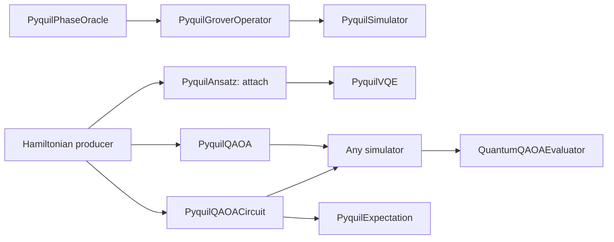

# pyQuil components

Quanifi provides **ten pyQuil processors**: the existing Grover circuit builder
and simulator, plus eight components for composition, variational algorithms,
and the quantum Fourier transform. Install the whole `nifi_extensions/` directory,
including its lowercase helper modules; copying a single processor file is not
sufficient.

## Run the examples

From the framework root:

```bash
uv sync --frozen --extra dev --extra iqm --python 3.12
.venv/bin/python tools/build_pyquil_examples.py --run
```

Open [the illustrated canvas](../../demo/pyquil/index.html) for three flows,
settings, recorded local outputs, and reports. The generator executes the real
processors with the test harness's NiFi API stubs; it does not contact a provider
or a running NiFi instance. Python 3.12 is used because some pinned dependencies
in the full framework lockfile do not have Python 3.14 wheels.

### Import into NiFi

1. Install the updated extension directory in NiFi's configured Python extension
   source directory, including `pyquil_components.py`, `pyquil_processor.py`,
   `quil_qasm.py` and `pauli_dsl.py`.
2. Wait for the new processor types to appear. NiFi installs dependencies from
   each processor's `ProcessorDetails.dependencies` in its own environment.
   The repository `.venv` and `uv.lock` do not configure those environments.
3. Import [pyquil-examples.json](../../demo/pyquil/pyquil-examples.json) as a
   process group using NiFi's flow upload/import action. This is a versioned flow
   snapshot, **not** a replacement for `conf/flow.json.gz`.
4. The snapshot targets the `nifi-standard-nar` **2.9.0** bundle. For another NiFi
   version, regenerate, for example:
   `python tools/build_pyquil_examples.py --nifi-version 2.11.0 --run`.
   Use the project `.venv/bin/python` for this command.
5. All processors import stopped (`ENABLED` in NiFi's flow schema). Set each
   report's **Reports Directory** to a writable directory; the default is
   `reports/pyquil`, relative to the NiFi worker's current working directory.
6. Start the downstream processors, then select **Run Once** on each
   `GenerateFlowFile` trigger. Starting the triggers normally produces a new
   example every minute. Failure connections lead to funnels for inspection;
   their contents are not discarded. Inspect the queued FlowFile's `*.error`
   attribute to diagnose a failed step.

The optional `iqm` extra is needed for the full framework test suite, including
its existing IQM tests; pyQuil examples alone do not require it.

The saved local results validate processor execution and configuration. They do
not establish that a particular live NiFi installation has loaded the extensions
or successfully imported the flow.

## Composition



Grover has three quantum stages: mark a state, prepare/amplify it, and sample it.
The trigger and report are ordinary workflow plumbing. The oracle is an
**unmeasured phase-flip circuit**, with no uniform-state preparation. Supplying a
complete Grover circuit to `PyquilGroverOperator` does not represent the same
algorithm.

VQE separates the Hamiltonian, trial-state recipe (ansatz), and solver. The
classical optimization loop stays in the solver so its state is scoped to one
FlowFile. It calls the same native builder exposed by `PyquilAnsatz` and the
same expectation function exposed by `PyquilExpectation`. Unlike QAOA below,
`PyquilVQE` still samples its own final counts (see "Output metadata").

QAOA similarly shares its native construction between `PyquilQAOACircuit` and
`PyquilQAOA` (both call `pyquil_components.qaoa`, via `pyquil_processor.qaoa_export`).
Both are **train/build-only**: they emit the bound circuit as portable
OpenQASM 2.0 and never sample. Use `PyquilQAOACircuit` to sweep explicit
angles with data-driven tests, compare engines, or evaluate an observable;
use `PyquilQAOA` to optimize angles. Either way, connect the output to any
counts-emitting simulator (`PyquilSimulator` or any other framework's), then
`QuantumQAOAEvaluator` to compute the sample-dependent QAOA metrics — see the
[QAOA components guide](QAOA_COMPONENTS.md) for the full chain, property
tables and the N×M example. Existing producers such as `QiskitHamiltonian` or
`CirqHamiltonian` provide the framework-neutral Hamiltonian. No separate
pyQuil Hamiltonian processor is needed.

## Processor reference

All new properties support FlowFile-attribute Expression Language, for example
`${grover.marked_state}` or `${qaoa.betas}`. Validation errors route to `failure`,
preserve the input content, and set the indicated error attribute. Successful
execution of an optimizer does not imply convergence; inspect `*.converged`.

| Processor | Input → output | Properties (defaults) | Error |
|---|---|---|---|
| `PyquilPhaseOracle` | Trigger → oracle QASM2 | Marked State (`11`) | `grover.error` |
| `PyquilGroverOperator` | Oracle QASM2/3 → Grover QASM2 | Num Iterations (`1`) | `grover.error` |
| `PyquilGroverCircuit` | Trigger → complete Grover QASM2 | Marked State (`11`), Num Iterations (`1`), Output Format (`qasm2`) | `grover.error` |
| `PyquilSimulator` | Circuit QASM2/3 → counts JSON | Shots (`1024`), Random Seed (unset), Noise Model (`none`), Error Probability (`0.01`) | `sim.error` |
| `PyquilAnsatz` | Trigger → bound QASM2, or Hamiltonian → Hamiltonian + recipe | Output Mode (`circuit`), Num Qubits (`2`), Reps (`1`), Rotations (`ry_rz`), Entanglement (`linear`), Parameters (`zeros`) | `ansatz.error` |
| `PyquilExpectation` | Circuit QASM2/3 + Hamiltonian property → expectation JSON | Hamiltonian (`${hamiltonian.json:replaceEmpty('Z0')}`) | `expectation.error` |
| `PyquilVQE` | Hamiltonian + pyQuil recipe → counts JSON + VQE attributes | Solver properties below | `vqe.error` |
| `PyquilQAOACircuit` | Diagonal Hamiltonian → bound QASM2 + builder attributes | Layers (`1`), Betas (`0.39269908169872414`), Gammas (`0.7853981633974483`) | `qaoa.error` |
| `PyquilQAOA` | Diagonal Hamiltonian → trained, bound QASM2 + training attributes (`qaoa.optimal_parameters`, `qaoa.optimal_value`, …) | Layers (`2`), Optimizer/Max Iterations/Initial Parameters/Random Seed — see the [QAOA components guide](QAOA_COMPONENTS.md) | `qaoa.error` |
| `PyquilQFT` | Trigger or circuit QASM2/3 → QFT QASM2 | Input Mode (`new`), Num Qubits (`2`), Inverse (`false`), Include Swaps (`true`) | `qft.error` |

### Common solver properties (`PyquilVQE`)

These are `PyquilVQE`'s own properties; it is the only pyQuil solver that still
samples its own final counts. `PyquilQAOA` shares the same optimizer mechanics
(`minimize_energy` in `pyquil_processor.py`) but a different property set — no
`Shots` (it trains only, and never samples), `Layers` instead of an ansatz
recipe, and `Random Seed` is unset by default, not `42`. See the
[QAOA components guide](QAOA_COMPONENTS.md) for `PyquilQAOA`'s exact properties.

| Property | Default | Meaning |
|---|---|---|
| Optimizer | `COBYLA` | `COBYLA`, `POWELL`, or `L_BFGS_B` (finite-difference gradients) |
| Max Iterations | `100` | 1–10000. COBYLA uses an evaluation budget; other methods use an iteration budget. SciPy may raise a too-small COBYLA budget to at least `number of parameters + 2`. |
| Shots | `1024` | 1–1000000, only for final sampling; does not affect exact-energy optimization |
| Initial Parameters | `random` | `random`, `zeros`, or a JSON/comma-separated list of finite angles |
| Random Seed | `42` | Integer 0–4294967295 for initial parameters and final sampling |

A finite result with exhausted iteration budget routes to `success` with
`vqe.converged=false` or `qaoa.converged=false`, the optimizer message, and actual
function evaluation count. This allows a downstream router to decide whether to
accept the approximate result. These are local minimizers; a converged result
need not be the global ground energy.

### Ansatz recipe and angles

`Output Mode=attach` requires Hamiltonian content and
`hamiltonian.format=sparse_pauli_op_json`. It preserves the content, obtains the
width from the Hamiltonian, and writes a versioned recipe in
`ansatz.pyquil_json` with `ansatz.format=pyquil_recipe_json`. `Num Qubits` and
`Parameters` are ignored in this mode. The recipe is a small declarative JSON
object, not executable code or a pickled Python object.

`Output Mode=circuit` uses `Num Qubits` and binds `Parameters`; `zeros` means
all angles are zero. The **bound** circuit has `circuit.num_parameters=0` while
`ansatz.num_parameters` describes the reusable recipe's parameter count.

Each of `Reps` layers has rotations followed by CNOT entanglement; a final rotation
layer follows. `Reps=0` is allowed. With `n` qubits and `r` repetitions there are
`n*(r+1)` parameters for `ry`, or `2*n*(r+1)` for `ry_rz`. Parameters run in layer
order, then qubit order, then RY followed by RZ. Entanglement is `linear`, `full`
(all index pairs in increasing order), or `none`. The same order applies to VQE
initial/optimal parameter lists.

### Hamiltonians and expectations

The shared Hamiltonian content uses **MSB-first Pauli labels**, as other Quanifi
Hamiltonian producers do:

```json
{"num_qubits":2,"terms":[["IZ",1.0,0.0],["XX",0.5,0.0]]}
```

`IZ` means Z on **qubit 0**, and `XX` means X on both qubits. Labels must match
the register width. Coefficients must be finite and real; nonzero imaginary
parts are rejected. Identity terms contribute to energy, even when omitted from
QAOA's circuit because they contribute only global phase. Widths must match;
`PyquilExpectation` does not silently drop idle qubits or truncate observables.

`PyquilExpectation.Hamiltonian` also accepts the existing indexed DSL, for example
`Z0 + 0.5 X0 X1`, and the DSL's JSON term form. Decimal notation and term syntax
follow `pauli_dsl.py`. Duplicate factors on the same qubit are rejected. A
QAOA circuit carries its cost in `hamiltonian.json`, which the default property
reads. An ordinary circuit without that attribute defaults to `Z0`.

Example output:

```json
{"expectation":-0.5,"num_qubits":2,"method":"exact_statevector","framework":"pyquil"}
```

The same value is in `expectation.value`; this output is not a shot-count
histogram and should not be fed to a distribution-comparison oracle.

### QAOA convention

The objective is **minimized**. Each layer applies `exp(-i gamma H)` followed by
`exp(-i beta sum(X))` (RX angle `2*beta` on each qubit), starting from a uniform
superposition. Only I/Z Hamiltonians are supported. For maximum-cut, minimize
the negative cut: `-0.5 + 0.5 Z0 Z1` for one unweighted edge.

`Betas` and `Gammas` each contain `Layers` finite angles. Solver parameter order
is all betas followed by all gammas. The default circuit angles are an example
setting, not a promise of optimality for an arbitrary cost.

`qaoa.optimal_value` is `PyquilQAOA`'s own exact expectation at its optimized
parameters (`energy_method=exact_statevector`) — it comes straight from the
solver, no simulator needed. Everything **sample-dependent** —
`qaoa.best_measurement`, `qaoa.best_value` (the lowest-cost **sampled**
bitstring, which can differ from the most frequent result, `sim.top_result`),
`qaoa.sampled_expectation`, `qaoa.exact_minimum`/`exact_maximum`,
`qaoa.approximation_ratio`, `qaoa.expectation_ratio` and `qaoa.optimal_probability`
— comes from `QuantumQAOAEvaluator`, computed from whichever simulator's counts
you connect downstream, not from `PyquilQAOA`/`PyquilQAOACircuit` themselves.
`qaoa.exact_minimum`/`exact_maximum` are the evaluator's own enumerated
classical reference; `approximation_ratio = (Emax - Ebest)/(Emax - Emin)`, or 1
for a constant cost. None of this is a claim of quantum advantage.

### QFT convention

With swaps, forward QFT has matrix
`F[y,x] = exp(2*pi*i*x*y/2**n)/sqrt(2**n)` for integers written with qubit 0 on the
left. `Input Mode=append` places it after the incoming circuit and derives the
width from that circuit. `Inverse=true` inverts the **entire selected forward
circuit**; with swaps, this means swaps appear first. Disabling swaps leaves
bit-reversed forward output. Inverting that same no-swap circuit still undoes it.

## Output metadata and interoperability

Circuit builders emit unmeasured OpenQASM 2.0 content, a matching
`circuit.qasm2` attribute, metrics and `builder.framework=pyquil`. The Grover
legacy component preserves its existing `builder.component=PyquilGrover` and
`circuit.bit_order=canonical` alias. New components use `q0_left` explicitly.
All displayed/sample bitstrings put qubit 0 on the left.

`PyquilVQE` emits **counts in content**; the optimized unmeasured circuit is
stored in `circuit.qasm2`. To execute it on a different engine, use NiFi
`ReplaceText` (Entire text, Always Replace) with replacement `${circuit.qasm2}`
and retain `circuit.format=qasm2`. Do not send the counts content directly to a
simulator. `PyquilVQE` also emits `report.type=simulation` for `QuanifiReport`,
`sim.*`, `run.seed`, and `vqe.*`: `framework`, `optimal_value`,
`optimal_parameters`, `cost_function_evals`, `max_iterations`, `converged`,
`optimizer_message`, `optimizer`, `num_qubits`, `shots`,
`energy_method=exact_statevector`.

`PyquilQAOA` and `PyquilQAOACircuit` are different: **content is the qasm2
circuit itself**, not counts, and there is nothing to `ReplaceText` — connect
their `success` relationship directly to any counts simulator. They emit
`report.type=circuit`, no `sim.*` keys, and `qaoa.*`: `framework`,
`layers`, `betas`, `gammas` (builder attributes, both processors), plus
(`PyquilQAOA` only) `optimal_parameters`, `optimal_value`,
`energy_method=exact_statevector`, `cost_function_evals`, `max_iterations`,
`converged`, `optimizer_message`, `optimizer`, `seed`. The sample-dependent
`qaoa.best_measurement`/`best_value`/`approximation_ratio`/etc. are not present
until `QuantumQAOAEvaluator` runs downstream of a simulator — see the
[QAOA components guide](QAOA_COMPONENTS.md).

QASM import uses Qiskit solely to parse/rebase gates. Circuit construction and
state evolution use pyQuil. No `get_qc`, remote `WavefunctionSimulator`, quilc
server, QVM server, or hardware account is required. Only the existing
`PyquilSimulator` supports post-gate noise; the new variational solvers and
expectation evaluator are ideal statevector computations. Their final histograms
sample the optimized pyQuil wavefunction with a seeded NumPy generator.

## Limits and validation

- Grover: 1–8 qubits, 0–100 iterations; the ancilla-free phase decomposition has
  exponential gate cost. Zero iterations produce only the uniform state.
- Existing `PyquilSimulator`: up to 16 ideal or 8 noisy qubits and 1–1000000 shots.
  Density-matrix simulation grows as 4**n; use small circuits/shot budgets.
- New general components/local exact simulation: 1–16 qubits, at most 16
  ansatz repetitions or QAOA layers; at most 4096 Hamiltonian terms. These are
  guardrails, not performance promises. Statevector cost grows exponentially.
- QASM interchange accepts unitary gate circuits; final measurements are removed
  before fresh execution. Mid-circuit measurements, resets and classical control
  are not supported. Gate modifiers and unbound/nonfinite gate angles are
  rejected by the exporter. SWAP exports as three CNOTs for strict QASM2 readers.
- Local seed reproducibility is verified with the project's pinned versions.
  Library upgrades can change optimizer trajectories or sampled counts.

## Validation and continuation

```bash
.venv/bin/python -m pytest tests/test_pyquil.py tests/test_pyquil_components.py tests/test_pyquil_processors.py tests/test_pyquil_examples.py -q
.venv/bin/python -m pytest -q --tb=short
```

The tests compare phase flips, Fourier matrices and cost evolution with analytical
or independently constructed references, verify solver ground energies and
exported optimal circuits, test malformed inputs and EL, and exercise the same
configuration used by the example canvas.

API reference: [pyQuil local simulation documentation](https://pyquil-docs.rigetti.com/en/stable/apidocs/pyquil.simulation.html).
The implementation was also checked against installed pyQuil 4.18.0.
