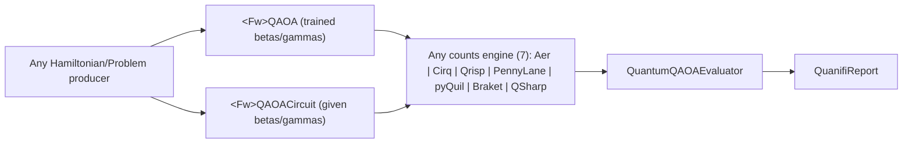

# QAOA components

Quanifi ships **five `<Fw>QAOA` solvers**, **five `<Fw>QAOACircuit` fixed-angle
builders**, and one framework-neutral **`QuantumQAOAEvaluator`** — eleven
processors that together let any QAOA construction (Qiskit, Cirq, Qrisp,
PennyLane, pyQuil) run on any counts engine (Aer, Cirq, Qrisp, PennyLane,
Braket, Q#, pyQuil) and be scored by one shared metric definition. Since
0.2.0 the solvers are **train-only**: they no longer sample, have no `Shots`
property, and emit the trained, bound circuit as portable OpenQASM 2.0 —
exactly the way the fixed-angle builders already did. See "Migration from
0.1.0" below if you have saved flows or scripts built against the old
sampling solvers.

Install the whole `nifi_extensions/` directory, including its lowercase
helper modules (`qaoa_contract.py`, `qiskit_qaoa.py`, `cirq_qaoa.py`,
`pennylane_qaoa.py`, `qrisp_qaoa.py`); copying a single processor file is not
sufficient. pyQuil's construction lives in the existing
`pyquil_processor.py`/`pyquil_components.py`, not a new module.

## Chain and conventions



Both the solver and the builder of a framework emit the qasm2 content plus
`circuit.*`/`builder.*`/`hamiltonian.json`/`qaoa.(layers|betas|gammas...)`
attributes — string-identical, because each framework's circuit is
constructed by exactly one function (in its helper module), called with
property angles by the builder and with trained angles by the solver. Any
counts engine reads that qasm2, adds measurement and samples it; all
upstream attributes ride through unchanged (NiFi FlowFile merge).
`QuantumQAOAEvaluator` then computes every sample-dependent result from the
counts plus `hamiltonian.json`, and stamps `qaoa.builder`/`qaoa.engine` so
each cell of the resulting N×M matrix is self-describing.

Shared conventions across all 11 processors:

- **Circuit:** Hadamard on every qubit, then for each layer `l = 1..p`:
  `U_C(gamma_l) = exp(-i*gamma_l*H)` followed by `RX(2*beta_l)` on every
  qubit. Identity terms are omitted from the circuit (they contribute only
  global phase) but always included in energies. The objective is
  **minimised**.
- **Bit order:** q0-left everywhere — qubit 0 is the leftmost character of
  every bitstring key and `circuit.bit_order`/`sim.bit_order` both read
  `q0_left`.
- **Energy of a bitstring `z`:** `E(z) = sum_t c_t * prod_{i in t} (1 - 2*z_i)`.
- **Width limits (guardrails, not performance promises):** 1–16 qubits,
  1–16 layers, 1–4096 Hamiltonian terms, 1–10000 Max Iterations, seed
  0–4294967295.
- Only diagonal (I/Z) cost Hamiltonians are accepted; identity-only
  Hamiltonians are rejected by every builder and solver (they have no γ
  parameters to train or sweep), but *are* accepted by the evaluator (their
  ratios become `1.0` — see below).
- **Input rule shared by builders and solvers.** If the incoming FlowFile
  already carries a circuit (`circuit.format` is non-blank — the *rebuild*
  path), the cost Hamiltonian is read from the `hamiltonian.json` attribute,
  which is how a trained solver's output can be re-built by any framework's
  builder via `${qaoa.betas}`/`${qaoa.gammas}`. Otherwise the Hamiltonian
  comes from FlowFile content, and requires
  `hamiltonian.format=sparse_pauli_op_json` from an upstream
  `<Fw>Hamiltonian`, `MaxCutProblem`, `QuboToHamiltonian` or similar encoder.

## Processor reference

| Processor | Input → output | Error attribute |
|---|---|---|
| `QiskitQAOA` | Diagonal Hamiltonian → trained qasm2 + training attributes | `qaoa.error` |
| `CirqQAOA` | Diagonal Hamiltonian → trained qasm2 + training attributes | `qaoa.error` |
| `PennylaneQAOA` | Diagonal Hamiltonian → trained qasm2 + training attributes | `qaoa.error` |
| `QrispQAOA` | Diagonal Hamiltonian → trained qasm2 + training attributes | `qaoa.error` |
| `PyquilQAOA` | Diagonal Hamiltonian → trained qasm2 + training attributes | `qaoa.error` |
| `QiskitQAOACircuit` | Diagonal Hamiltonian + Betas/Gammas → bound qasm2 | `qaoa.error` |
| `CirqQAOACircuit` | Diagonal Hamiltonian + Betas/Gammas → bound qasm2 | `qaoa.error` |
| `PennylaneQAOACircuit` | Diagonal Hamiltonian + Betas/Gammas → bound qasm2 | `qaoa.error` |
| `QrispQAOACircuit` | Diagonal Hamiltonian + Betas/Gammas → bound qasm2 | `qaoa.error` |
| `PyquilQAOACircuit` | Diagonal Hamiltonian + Betas/Gammas → bound qasm2 | `qaoa.error` |
| `QuantumQAOAEvaluator` | Counts (`sim.bit_order=q0_left`) + Hamiltonian → same counts + QAOA metrics | `qaoa.error` |

All properties support FlowFile-attribute Expression Language
(`FLOWFILE_ATTRIBUTES` scope), for example `Betas="${qaoa.betas}"`.
Validation errors route to `failure`, **preserve the input content**, and set
`qaoa.error`. Every changed processor carries a version bump (all five
solvers and `QuantumQAOAEvaluator` are `0.2.0`/`0.1.0` respectively; the four
new builders are `0.1.0`; `PyquilQAOACircuit` was rewritten to `0.2.0`).

### Solver properties (identical text across all five frameworks)

| Property | Required | Default | Validator | EL scope | Rule |
|---|---|---|---|---|---|
| Layers | yes | `2` | POSITIVE_INTEGER | FLOWFILE_ATTRIBUTES | 1..16 |
| Optimizer | yes | `COBYLA` | allowable list (per framework, below) | none | must be in list |
| Max Iterations | yes | `100` | POSITIVE_INTEGER | FLOWFILE_ATTRIBUTES | 1..10000 |
| Initial Parameters | yes | `random` | NON_EMPTY | FLOWFILE_ATTRIBUTES | `random`, `zeros`, or a JSON/comma list of exactly 2p finite angles, betas then gammas |
| Random Seed | no | *(unset)* | NON_NEGATIVE_INTEGER | FLOWFILE_ATTRIBUTES | unset = nondeterministic; 0..4294967295 |
| Mixer Type (QrispQAOA only, inserted at index 1) | yes | `RX` | allowable `RX`/`XY` | none | Qrisp-only |

Per-framework `Optimizer` lists: `QiskitQAOA`
`COBYLA/SPSA/NELDER_MEAD/L_BFGS_B`; `CirqQAOA`/`PennylaneQAOA`
`COBYLA/NELDER_MEAD/POWELL/L_BFGS_B`; `QrispQAOA`
`COBYLA/NELDER_MEAD/POWELL`; `PyquilQAOA` `COBYLA/POWELL/L_BFGS_B`.

`Random Seed` seeds initial-parameter generation and any optimizer-internal
sampling; it does **not** seed the downstream simulator's measurement
sampling, which has its own `Random Seed` property. A finite result with an
exhausted iteration budget still routes to `success`, with
`qaoa.converged=false` and the optimizer's own message; downstream logic can
decide whether to accept an unconverged result. These are local minimizers —
a converged result is not guaranteed to be the global ground energy.

### Builder properties (identical text across all five frameworks)

| Property | Required | Default | Validator | EL scope | Rule |
|---|---|---|---|---|---|
| Layers | yes | `1` | POSITIVE_INTEGER | FLOWFILE_ATTRIBUTES | 1..16 |
| Betas | yes | `0.39269908169872414` | NON_EMPTY | FLOWFILE_ATTRIBUTES | JSON or comma list, exactly Layers finite floats |
| Gammas | yes | `0.7853981633974483` | NON_EMPTY | FLOWFILE_ATTRIBUTES | same |
| Mixer Type (QrispQAOACircuit only, appended last) | yes | `RX` | allowable `RX`/`XY` | none | Qrisp-only |

The default angles (`pi/8`, `pi/4`) are an example setting for demos, not a
claim of optimality for an arbitrary cost.

## Attribute contracts

### Circuit contract (`qaoa_contract.circuit_attributes`; every builder and solver)

| Attribute | Value |
|---|---|
| `circuit.format` | `qasm2` |
| `circuit.qasm2` | same text as FlowFile content |
| `circuit.qasm3`, `circuit.cirq_json` | `""` (blanked stale so `QuanifiReport` prefers `qasm3` when a different processor set it) |
| `circuit.svg` | Cirq's own SVG for Cirq processors; `""` otherwise (blanked stale so `QuanifiReport` prefers a stale SVG only when nothing fresher exists) |
| `circuit.diagram` | framework-native text diagram |
| `circuit.num_qubits`, `circuit.depth`, `circuit.gate_count`, `circuit.nonlocal_gates` | from `qasm2_profile` (identical semantics across all 5 rows — see "Portable qasm2 subset" below) |
| `circuit.gate_counts` | JSON `{gate: count}`, sorted keys |
| `circuit.t_count` | `"0"` |
| `circuit.framework`, `builder.framework` | `qiskit` / `cirq` / `pennylane` / `qrisp` / `pyquil` |
| `builder.component` | the emitting processor's class name |
| `circuit.bit_order` | `q0_left` |
| `circuit.algorithm` | `qaoa` |
| `circuit.num_parameters` | `"0"` (bound, no free parameters remain) |
| `circuit.marked_state`, `circuit.num_iterations`, `circuit.error` | `""` |
| `mime.type` | `text/plain` |
| `report.type` | `circuit` |

PennyLane processors additionally set `circuit.global_phase_dropped`
(`"true"`/`"false"`) — PennyLane's `to_openqasm` export drops a `gphase`
statement if present, and this attribute records whether one was.

### Builder/solver `qaoa.*` contract (`qaoa_contract.builder_attributes`; every builder and solver)

Blanks every `EVALUATOR_KEYS` entry (stale-key hygiene — see "Stale-attribute
rules" below), then adds: `hamiltonian.json` (the raw wire text the circuit
was built from), `qaoa.num_qubits`, `qaoa.layers`, `qaoa.betas` and
`qaoa.gammas` (each `json.dumps([float, ...])`, full `repr` precision,
lossless), `qaoa.mixer_type` (`"RX"` or `"XY"`), `qaoa.error=""`.

### Solver-only `qaoa.*` extension (`qaoa_contract.solver_attributes`)

| Attribute | Value |
|---|---|
| `qaoa.framework` | `qiskit`/`cirq`/`pennylane`/`qrisp`/`pyquil` |
| `qaoa.optimal_parameters` | `json.dumps(betas + gammas)`, full precision, no rounding |
| `qaoa.optimal_value` | `repr(float)`, the optimizer's own final objective |
| `qaoa.energy_method` | see the table below |
| `qaoa.energy_shots` | `"1024"` for `QiskitQAOA`; `""` for the other four |
| `qaoa.optimizer`, `qaoa.max_iterations`, `qaoa.cost_function_evals`, `qaoa.num_iterations` | `num_iterations` always equals `cost_function_evals` |
| `qaoa.converged` | scipy's `result.success` for Cirq/PennyLane/pyQuil; `evals < maxiter` for Qiskit/Qrisp |
| `qaoa.optimizer_message` | scipy's `result.message`, else `""` |
| `qaoa.seed` | the seed, or `""` if unset — solvers do **not** write `run.seed`; that attribute belongs to the downstream engine's own sampling seed |
| `qaoa.elapsed_seconds`, `perf.elapsed_seconds` | `"{:.4f}"` training wall-clock time |

Solvers emit **no** `sim.*` keys — those come only from a downstream counts
engine.

### `qaoa.energy_method` per solver

| Solver | `energy_method` | Notes |
|---|---|---|
| `QiskitQAOA` | `sampled_statevector` | Trained via `qiskit_algorithms.QAOA` with a seeded `StatevectorSampler`. **The objective is sampled, not exact** — `StatevectorSampler.default_shots == 1024`. Measured gap between the sampled and exact eigenvalue at `optimal_point`: 0.030 at 1024 shots, 4.4e-4 at 100000 shots (about 15x slower). `qaoa.energy_shots="1024"` records this. |
| `CirqQAOA` | `exact_statevector` | Hand-rolled sympy ladder, `cirq.Simulator(dtype=complex128)` exact expectation. |
| `PennylaneQAOA` | `exact_statevector` | `default.qubit` analytic `qml.expval`. |
| `QrispQAOA` | `exact_probabilities` | Qrisp's own `QAOAProblem.optimization_routine`, exact probabilities that Qrisp itself rounds to 5 decimals (see "Qrisp energy rounding" below). |
| `PyquilQAOA` | `exact_statevector` | `pyquil_components.expectation`, exact local expectation. |

### `QuantumQAOAEvaluator` contract

One property, `Hamiltonian` (required, default `${hamiltonian.json}`,
NON_EMPTY, FLOWFILE_ATTRIBUTES EL) — either the neutral wire JSON
(`hamiltonian.json` from any upstream builder/solver) or the indexed DSL
(`Z0 Z1 - 0.5 Z2 + 1`, width inferred from the counts). Validation order:

1. `sim.bit_order` must equal `q0_left` (missing or any other value fails).
2. Parse the counts content: a non-empty JSON object with equal-width binary
   keys and finite, non-negative, non-bool values (integer counts or
   probabilities), total > 0.
3. Resolve the Hamiltonian (blank → a clear "no cost Hamiltonian" error).
4. It must be diagonal — unlike the builders/solvers, **identity-only is
   allowed here** (ratios become `1.0`, since there is nothing to
   distinguish).
5. Counts width must equal the Hamiltonian's qubit count.
6. If `circuit.num_qubits` is present and disagrees, fail.

Metric definitions (content passes through unchanged):

| Attribute | Definition |
|---|---|
| `qaoa.best_measurement` | the observed key minimising `(round(E, 9), key)` — lowest energy, ties broken lexicographically so it is comparable across engines/counts totals |
| `qaoa.best_value` | `repr(E(best))` |
| `qaoa.sampled_expectation` | `sum(counts[k] * E(k)) / sum(counts.values())` |
| `qaoa.exact_minimum`, `qaoa.exact_maximum` | min/max of `E` over all `2^n` states (includes identity terms) |
| `qaoa.approximation_ratio` | `(Emax - E_best) / (Emax - Emin)`; `1.0` if `Emax - Emin <= 1e-12` |
| `qaoa.expectation_ratio` | `(Emax - sampled_expectation) / (Emax - Emin)`; `1.0` if degenerate |
| `qaoa.optimal_probability` | observed mass on states whose energy rounds (9 dp) to the exact minimum |
| `qaoa.optimal_states` | sorted JSON list of all optimal q0-left states (first 64) |
| `qaoa.num_optimal_states` | the true count of optimal states, uncapped |
| `qaoa.shots` | integer total if every count value is integral, else `sim.shots` or `""` |
| `qaoa.builder`, `qaoa.engine` | copies of `builder.component`/`sim.component` (or `""` if absent) |
| `qaoa.evaluator` | `"QuantumQAOAEvaluator"` |
| `qaoa.num_qubits`, `qaoa.error` | `str(n)`, `""` |
| `report.type`, `mime.type` | `simulation`, `application/json` |

On failure: content is preserved, `qaoa.error` is set, and every
`EVALUATOR_KEYS` entry is blanked (a stale success must never survive a
failed re-evaluation).

### Stale-attribute rules

NiFi FlowFile merges never drop attributes, so every hop is explicit about
what it owns:

- Builders and solvers blank every `EVALUATOR_KEYS` entry plus
  `circuit.qasm3`, `circuit.cirq_json`, `circuit.svg` (unless they produce
  one), `circuit.marked_state`, `circuit.num_iterations` and
  `circuit.error`.
- Builders never touch solver-owned keys. On the rebuild path (feeding a
  solver's output into a different framework's builder) those keys still
  describe the solver that originally trained the angles.
- `QuantumQAOAEvaluator` overwrites all `EVALUATOR_KEYS` on success and
  blanks them on failure.
- `hamiltonian.json`, `builder.*` and `circuit.*` ride through the counts
  engine hop untouched.

## Portable qasm2 subset (the N×M interchange contract)

Every builder and solver emits, and `QuantumQAOAEvaluator` implicitly
depends on via `circuit.num_qubits`, a strict portable subset of OpenQASM
2.0: `OPENQASM 2.0;`, optional `include "qelib1.inc";`, exactly **one**
`qreg`, and gates only from `{h, x, rx, ry, rz, cx}`. No `creg`, `measure`,
`barrier`, `reset`, `gate`, `opaque`, `if` or `gphase`. This is enforced by
`qaoa_contract.qasm2_profile()` (hand-rolled regex/statement parsing, no
`qiskit.qasm2` dependency) before any builder or solver returns, and its
metrics (`num_qubits`/`depth`/`gate_count`/`nonlocal_gates`) agree with
Qiskit's own `QuantumCircuit.depth()`/`.size()` on all five dialects.

Per-framework export facts that motivated this subset:

- **Qiskit:** `transpile(bound, basis_gates=["h","rx","rz","cx"], optimization_level=0)` then `qasm2.dumps` gives exactly `{h, cx, rz, rx}` in one `qreg`. `decompose()` alone emits `rzz`, which is not in the portable set — transpiling is required. `QAOAAnsatz` is deprecated (an `NLocal` subclass, removed in Qiskit 3.0); the non-deprecated `qiskit.circuit.library.qaoa_ansatz()` has the same parameter order and F=1, so the builders and `QiskitQAOACircuit` use it, while `qiskit_algorithms.QAOA` still trains internally with the deprecated `QAOAAnsatz` (expect a `DeprecationWarning` in logs — the unitary and parameter order of both are verified equal).
- **Cirq:** `circuit.to_qasm()` gives `{h, cx, rz, rx}` directly, with angles written as `pi*<10 significant digits>` plus `//` comment lines (both handled by `qasm2_profile`'s comment-stripping).
- **PennyLane:** `qml.to_openqasm(qnode, measure_all=False)()` gives `{h, cx, rz}` — the RX mixer is exported as `h . rz . h` (no native `rx` in PennyLane's OpenQASM exporter). No `gphase` statement is emitted even with an identity Hamiltonian term.
- **Qrisp:** `qv.qs.compile().to_qiskit()` gives `{h, cx, rz, rx}` but declares **one `qreg` per qubit** (`qreg qv_0[1]; qreg qv_1[1]; ...`); every builder/solver composes this into a single `n`-qubit `QuantumCircuit` before emitting, which is what makes the output importable on `QSharpSimulator` (the raw multi-qreg export fails there with a register-ambiguity error). The **XY mixer** additionally exports `s, sdg, sx, sxdg` (`sx` is rejected by `QSharpSimulator`); whenever any non-portable gate appears, the export is rebased with `transpile(..., basis_gates=["h","x","rx","ry","rz","cx"], optimization_level=0)` before emission — rebasing only happens when needed, since it also changes the RX export's text.
- **pyQuil:** `quil_qasm.to_qasm2` gives `{h, cx, rz, rx}` in one `qreg` directly.

## N×M flow

The 5 builders × 7 engines matrix is the point of this extraction: one qasm2
circuit per builder, built at the *same* explicit angles across all five
frameworks, runs unmodified on all seven counts engines and is scored by one
`QuantumQAOAEvaluator`. The generated canvas
(`demo/qaoa/qaoa-nxm.json`, also documented as "Flow 35" in the
[NiFi flow configuration guide](NIFI_FLOW_CONFIGURATION_GUIDE.md#flow-35-qaoa-nm-5-builders-7-engines))
wires: one `QiskitHamiltonian` trigger → 5 builders (each `Layers=2`,
`Betas=[-0.67, -0.42]`, `Gammas=[1.14, 1.27]`) → each builder's `success`
fanned out to all 7 engines (35 connections) → each engine's `success` into
one shared `QuantumQAOAEvaluator` → one shared `QuanifiReport`.

The instance is `H_NXM = -0.8 Z0 Z1 + 0.5 Z1 Z2 - 0.3 Z0 + 0.2` (3 qubits).
Its unique ground state is `001` (E=-1.4); every one of the 35 cells reaches
`qaoa.best_measurement="001"` and `qaoa.exact_minimum=-1.4` /
`qaoa.approximation_ratio=1.0` — the whole point is that cells are scored as
**distributions**, not by their argmax alone (a test deliberately mirrors one
row's qubit indices and shows it still reports `best_measurement="001"`
while its Hellinger distance to the reference jumps past 0.3).

Thresholds, measured on the pinned environment:

- The 6 seedable engines (Aer, Cirq, Qrisp, PennyLane, Q#) at 4096 shots,
  `Random Seed=11`: worst measured Hellinger distance to the exact
  distribution across all 5 rows is **0.0187**, well inside the plan's
  statistical bound for this instance (0.9999-quantile 0.0304 over 50000
  multinomial draws).
- **`BraketSimulator` has no `Random Seed` property and is unseedable.** Its
  column is included in the N×M matrix but compared only *statistically*
  (against the same bound above, max observed 0.0316 over 50000 trials) —
  never for exact-value equality against a saved cell. Regenerating the
  example canvas twice in a row changes only this column's numbers.
- **`PyquilSimulator` costs about 13.6 ms/shot** via its pure-Python PyQVM
  (no external `quilc`/`qvm` server); the N×M column therefore runs at
  **256 shots**, not 4096. Measured Hellinger distance: consistently
  **0.0439** (256 shots) across repeated regenerations, well under its own
  0.20 statistical bound for this shot count. Raising its shot count in the
  canvas without re-timing will make the regeneration/tests noticeably
  slower (about 3.3s at 256 shots per builder in isolation, 14s at 1024).

## Example canvases

Regenerate the local example canvases and reports:

```bash
.venv/bin/python tools/build_qaoa_examples.py --run --nxm
```

or via `just qaoa-examples`. This produces `demo/qaoa/qaoa-lanes.json` (10
single-processor lanes, one per QAOA processor type — see the table below),
`demo/qaoa/qaoa-nxm.json` (the N×M matrix above), and `demo/qaoa/index.html`
(a static overview linking both snapshots, per-lane result cards, and the
N×M Hellinger table). Like `tools/build_pyquil_examples.py`, the generator
runs the real processors through the test harness's NiFi API stubs — it does
not contact a provider or a running NiFi instance, and it never hand-edits
`demo/**`; regenerate through the tool after any change that affects a
lane's output.

| Lane key | Encoder | QAOA processor | Engine |
|---|---|---|---|
| `qiskit-qaoa` | `MaxCutProblem` | `QiskitQAOA` (Layers 2, Max Iterations 150, Random Seed 11) | `CirqSimulator` |
| `cirq-qaoa` | `QuboToHamiltonian` | `CirqQAOA` (same) | `QrispSimulator` |
| `pennylane-qaoa` | `MaxIndependentSetProblem` | `PennylaneQAOA` (same) | `QSharpSimulator` |
| `qrisp-qaoa` | `PortfolioRebalancingProblem` | `QrispQAOA` (Layers 2, Mixer Type XY, Max Iterations 100, Random Seed 11) | `PennylaneSimulator` |
| `pyquil-qaoa` | `QiskitHamiltonian` (`-0.5 + 0.5 Z0 Z1`) | `PyquilQAOA` (Layers 1, Optimizer L_BFGS_B, Max Iterations 100, Initial Parameters `[-0.3,1]`, Random Seed 42) | `PyquilSimulator` (Shots 256, Random Seed 42) |
| `qiskit-qaoa-circuit` | `QiskitHamiltonian` (`H_NXM`) | `QiskitQAOACircuit` (N×M angles) | `QiskitAerSimulator` |
| `cirq-qaoa-circuit` | `CirqHamiltonian` (`H_NXM`) | `CirqQAOACircuit` (N×M angles) | `QSharpSimulator` |
| `pennylane-qaoa-circuit` | `MaxCutProblem` | `PennylaneQAOACircuit` (defaults) | `QiskitAerSimulator` |
| `qrisp-qaoa-circuit` | `QrispHamiltonian` (`H_NXM`) | `QrispQAOACircuit` (N×M angles) | `CirqSimulator` |
| `pyquil-qaoa-circuit` | `MaxCliqueProblem` | `PyquilQAOACircuit` (defaults) | `QrispSimulator` |

All six seedable engines and every Hamiltonian producer/encoder appear
across these ten lanes; `BraketSimulator` appears only in the N×M matrix,
per its unseedable-engine rule above. Every lane ends
`... → QuantumQAOAEvaluator → QuanifiReport`.

### Import into NiFi

Follow the same procedure as the [pyQuil guide](PYQUIL_COMPONENTS.md#import-into-nifi):
install the updated `nifi_extensions/` directory (including the QAOA helper
modules above), wait for NiFi to install each processor's declared
dependencies in its own environment, import `qaoa-lanes.json` and/or
`qaoa-nxm.json` as process groups, start the downstream processors, then
**Run Once** each trigger. All processors import stopped (`ENABLED`). As
with every canvas in this repository, **these artifacts are validated
structurally and executed headlessly by the generator** — this guide does
not claim live NiFi execution of the N×M canvas.

**NiFi deployment note.** Six existing processors changed dependencies or
version in this work: `QiskitQAOA` (dropped `qiskit-aer`), `CirqQAOA`,
`PennylaneQAOA`, `QrispQAOA` (dropped `qiskit-qasm3-import`), `PyquilQAOA`,
and `PyquilQAOACircuit` (rewritten to 0.2.0). A live NiFi deployment must
**delete the cached extension venvs**
`work/python/extensions/{QiskitQAOA,CirqQAOA,PennylaneQAOA,QrispQAOA,PyquilQAOA,PyquilQAOACircuit}/`
so NiFi rebuilds them against the new `ProcessorDetails.dependencies`;
otherwise the old venv (missing the QAOA helper modules, or carrying a stale
dependency set) is reused. The five new processors
(`QiskitQAOACircuit`, `CirqQAOACircuit`, `PennylaneQAOACircuit`,
`QrispQAOACircuit`, `QuantumQAOAEvaluator`) have no prior venv to clear.
**This wipe was not performed as part of this work** — no live NiFi instance
was touched; it is documented here for whoever deploys the change.

## Migration from 0.1.0

If you have flows or scripts built against the pre-0.2.0 solvers:

- **`Shots` is removed** from all five solvers. They no longer sample.
- **Counts now come from any downstream simulator**, not from the solver
  itself. Insert one between the solver and anything that used to read its
  counts content.
- **`qaoa.best_measurement`/`qaoa.best_value`/`qaoa.approximation_ratio`/
  `qaoa.exact_minimum`/`qaoa.shots`/`run.seed`** are no longer emitted by
  the solver. They now come from `QuantumQAOAEvaluator` (or, for
  `run.seed`, from the engine you choose), computed downstream of whichever
  simulator you connect — insert `QuantumQAOAEvaluator` after the
  simulator wherever your flow or script reads these.
- **`QrispQAOA`'s `Initial Parameters` is now canonical beta-then-gamma**,
  matching every other solver and builder (Qrisp's own internal ordering,
  gamma-then-beta, is converted at the boundary via
  `qrisp_qaoa.to_qrisp_theta`/`from_qrisp_theta`). A 0.1.0 value written in
  Qrisp's own order will train the wrong angles under 0.2.0.
- **The `QrispQAOA` mirror-training bug is fixed.** The 0.1.0 processor
  reversed measurement keys in both its training loss and its reported best
  measurement, which trained and reported the *bit-reversed* Hamiltonian
  (verified: for `H = -Z0 + 0.3 Z1`, it reported best `01` while its own
  emitted circuit actually favoured `10`, P=0.687). 0.2.0 uses
  `qaoa_contract.energy_vector`'s q0-left indexing directly, with no
  reversal, by construction. Any 0.1.0 result computed from `QrispQAOA` that
  matters for correctness should be recomputed, not carried forward.
- **`PyquilQAOA`'s `Layers` default is now `2`** (was `1`, unified with the
  other four solvers) and **`Random Seed` is now unset by default** (was a
  required `42`) — set it explicitly if you relied on the old default seed.
- A live NiFi deployment needs a **venv wipe** for the six changed
  processors — see "NiFi deployment note" above.

## Known limitations

- **`BraketSimulator` is unseedable** — it has no `Random Seed` property.
  It appears only in the N×M matrix (not the ten deterministic
  single-processor lanes) and its cells are compared statistically, never
  for exact equality.
- **`PyquilSimulator` is the slow column** — about 13.6 ms/shot via its
  pure-Python PyQVM. The N×M matrix samples it at 256 shots (not 4096 like
  the other six engines) to keep regeneration and the test suite fast;
  raising this without re-timing will slow both down noticeably.
- **`QiskitQAOA`'s training objective is sampled, not exact** — its
  `StatevectorSampler` defaults to 1024 shots (`qaoa.energy_method=
  sampled_statevector`, `qaoa.energy_shots="1024"`). This is an intentional,
  documented characteristic, not a bug: the measured gap to the exact
  eigenvalue was 0.030 at 1024 shots and 4.4e-4 at 100000 shots (about 15x
  slower), so `QiskitQAOA`'s energy-consistency tests use a statistical
  (6-sigma) tolerance rather than an exact one.
- **`QrispSimulator`'s `Random Seed` is best-effort**, seeded via the
  global NumPy RNG (Qrisp's sampler exposes no seed API of its own) — this
  is a pre-existing, documented characteristic of `QrispSimulator` itself,
  distinct from the `QrispQAOA` *solver's* determinism (which draws from a
  local generator and does not touch global state as of the fix described
  below). Because of this, the generated example canvas compares
  `QrispSimulator`-engine lanes only on their deterministic fields (circuit,
  Hamiltonian, non-sampling attributes); sampling-derived fields (counts,
  `qaoa.best_measurement`, etc.) are checked for shape and validity, not
  byte-for-byte equality across regenerations. This was found and
  documented while building the example generator (M7); it is unrelated to
  and unaffected by the QrispQAOA solver fixes below.
- **Qrisp's XY mixer is not K-hot constrained** — it starts from the
  uniform superposition, not a fixed-Hamming-weight state, so it does not
  guarantee the "exactly K selected" property some QAOA applications (e.g.
  budget-constrained portfolio selection) want from it in isolation; that
  constraint comes from how `QrispQAOA`/`QrispQAOACircuit` initialize the
  register in practice, not from the mixer alone. It is Qrisp-specific
  semantics, existing before this work and documented rather than changed
  here. **The XY mixer is not part of the N×M builder rows** — those always
  use the cross-framework RX convention so all five rows share one unitary
  construction; XY appears only in the single-processor `qrisp-qaoa` /
  `qrisp-qaoa-circuit` lanes and `QrispQAOA`'s own tests.
- **Qrisp energy rounding.** Qrisp's exact-probability measurement backend
  already rounds probabilities to 5 decimals internally (max error about
  3.2e-6). `QrispQAOA`'s classical cost function additionally rounds its
  *returned energy* to 12 decimals before handing it to the optimizer. This
  is not cosmetic: Qrisp's backend differs by up to 1 ulp (2.22e-16) between
  separately compiled circuits evaluated at the *same* angles, and scipy's
  Fortran-backed `COBYLA`/`POWELL` optimizers chaotically amplify that
  1-ulp jitter over ~100 iterations into macroscopic (0.06-0.2 rad)
  parameter drift between otherwise-identical seeded runs. Rounding to 12
  decimals removes the drift outright (measured: 40 seeded COBYLA repeats,
  each run after an unrelated intervening run, gave exactly 0.0 parameter
  drift) while losing no resolution beyond Qrisp's own 5-decimal probability
  rounding. `NELDER_MEAD` (pure Python/NumPy, no Fortran extension) was
  never affected by this and needed no such fix.

## Verification

```bash
.venv/bin/python -m pytest tests/test_qaoa*.py tests/test_bit_order.py tests/test_seeds.py tests/test_numeric_guards.py \
  tests/test_problem_encoders.py tests/test_qrisp_qaoa_problems.py tests/test_qrisp_cross_framework.py \
  tests/test_pyquil_processors.py tests/test_pyquil_examples.py tests/test_reporting.py tests/test_processor_dependencies.py \
  tests/test_all_components_group.py tests/test_qrisp_components_group.py -q --tb=short
.venv/bin/python -m pytest -q -m "not slow"
.venv/bin/python -m pytest -q --tb=short
```

The numbers referenced above are reproduced by the test suite, which is the
authoritative record for this extraction.
